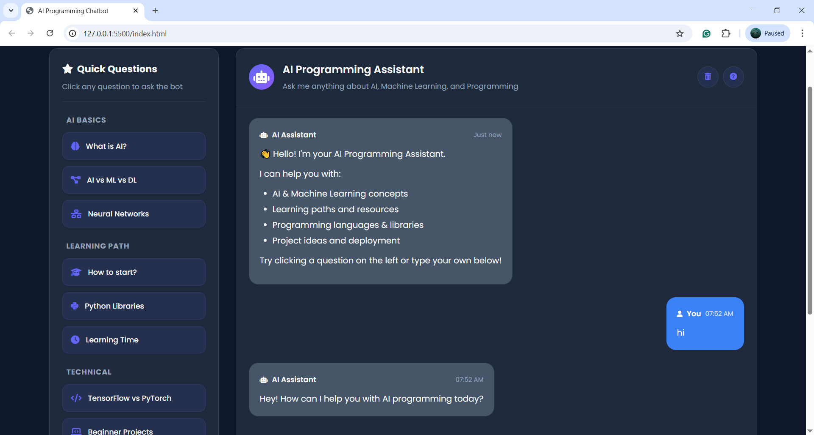

# 🤖 AI Programming Assistant Chatbot


A fully functional, web-based chatbot trained to answer questions about Artificial Intelligence, Machine Learning, and programming concepts.

> **Part of my ML Learning Series:** This chatbot recommends beginner projects, and I'm building each one! [See Iris Classification →](https://github.com/MohammedAlphy/-Iris-Flower-Classification---Complete-ML-Project.git)

## 🎯 Live Demo

**[Try the Chatbot Live!](https://mohammedalphy.github.io/AI-Programming-Assistant-Chatbot/)** - No installation needed!



## ✨ Features

✅ **Web-Based Interface** - Beautiful dark/light theme  
✅ **25+ AI Topics** - From basics to advanced concepts  
✅ **Interactive Q&A** - Real-time conversation simulation  
✅ **Quick Questions Sidebar** - Instant access to common queries  
✅ **Mobile Responsive** - Works on all devices  
✅ **No Backend Required** - Runs entirely in browser  
✅ **Easy to Extend** - Add new questions via JSON  

## 🏗️ Architecture

```
Frontend (Browser)
├── HTML/CSS → Beautiful UI
├── JavaScript → Chat logic
└── JSON → 150+ Q/A training data
```

## 🚀 Quick Start

### Option 1: Live Demo
Simply visit the [GitHub Pages link](https://mohammedalphy.github.io/AI-Programming-Assistant-Chatbot/) - no installation needed!

### Option 2: Local Installation
```bash
# Clone the repository
git clone https://github.com/yourusername/ai-programming-chatbot.git
cd ai-programming-chatbot

# Open in browser (no server needed!)
# Simply open index.html in your browser

# Or use a local server (optional)
python -m http.server 8000
# Then visit: http://localhost:8000
```

## 📚 What Can It Answer?

The chatbot is trained on **150+ questions** across 25 categories:

### 🎓 **Learning Path**
- "How do I start learning AI?"
- "What math do I need for ML?"
- "Best resources for beginners?"

### 💻 **Technical Questions**
- "Python vs R for AI?"
- "TensorFlow vs PyTorch?"
- "How to deploy ML models?"

### 🚀 **Project Guidance**
- "Beginner AI project ideas"
- "Where to find datasets?"
- "ML project workflow"

### 🔧 **Tools & Libraries**
- "Essential Python ML libraries"
- "Do I need a powerful computer?"
- "Cloud platforms for AI"

## 🛠️ Technology Stack

| Layer | Technology | Purpose |
|-------|------------|---------|
| **Frontend** | HTML5, CSS3, JavaScript | User interface |
| **Styling** | CSS Grid/Flexbox, Custom CSS | Responsive design |
| **Logic** | Vanilla JavaScript | Chatbot intelligence |
| **Data** | JSON (intents.json) | Training data |
| **Icons** | Font Awesome 6 | UI icons |
| **Fonts** | Google Fonts (Poppins, Roboto Mono) | Typography |

## 📊 Training Data Structure

The chatbot uses an **intent-based classification** system:

```json
{
  "intents": [
    {
      "tag": "what_is_ai",
      "patterns": ["What is AI?", "Define artificial intelligence"],
      "responses": ["AI is..."]
    }
  ]
}
```

### Training Data Stats:
- **25 intent categories**
- **150+ question patterns**
- **Multiple response variations** per intent
- **Fallback handling** for unknown questions

## 🎨 UI Features

### 1. **Dual Theme Support**
- Dark theme (default)
- Light theme toggle

### 2. **Interactive Elements**
- Typing indicators
- Message timestamps
- Quick question sidebar
- Hint tags for common queries

### 3. **User Experience**
- Mobile-responsive design
- Smooth animations
- Error handling
- Chat history (browser session)

## 🔧 Extending the Chatbot

### Add New Questions:
1. Edit `intents.json`
2. Add new intent object:
```json
{
  "tag": "new_topic",
  "patterns": ["question 1", "question 2"],
  "responses": ["answer 1", "answer 2"]
}
```

### Customize Styling:
1. Edit `style.css`
2. Modify CSS variables:
```css
:root {
  --primary-color: #your-color;
  --bg-color: #your-color;
}
```

### Add New Features:
1. Edit `script.js`
2. Extend the `AIChatbot` class
3. Add new event listeners

## 📁 Project Structure

```
ai-programming-chatbot/
├── index.html          # Main HTML structure
├── style.css           # All styling (600+ lines)
├── script.js           # Chatbot logic (400+ lines)
├── intents.json        # Training data (150+ Q/A)
├── README.md           # This documentation
├── LICENSE             # MIT License
├── .gitignore          # Git ignore rules
├── CONTRIBUTING.md     # Contribution guidelines
├── demo-screenshot.png # UI screenshot
└── examples/           # Example files
    └── conversation-example.txt
```

## 🔗 Connected Projects

This chatbot is part of my **ML Learning Journey**:

1. **🤖 This Chatbot** - Recommends beginner projects
2. **🌺 [Iris Classification](https://github.com/MohammedAlphy/-Iris-Flower-Classification---Complete-ML-Project.git)** - First recommended project (built!)
3. **🔢 [MNIST Digits](https://github.com/MohammedAlphy/mnist-digits)** - Coming soon!
4. **🎬 [Movie Recommender](https://github.com/MohammedAlphy/movie-recommender)** - Planned

The chatbot literally recommends projects that I then build and document!

## 🎓 Learning Outcomes

Building this chatbot taught me:
- **Intent-based NLP** without complex ML models
- **Frontend development** with pure HTML/CSS/JS
- **JSON-based training data** structure
- **Responsive web design** principles
- **Project documentation** best practices

## 🤝 Contributing

Contributions are welcome! See [CONTRIBUTING.md](CONTRIBUTING.md) for guidelines.

1. **Fork** the repository
2. **Create** a feature branch
3. **Commit** your changes
4. **Push** to the branch
5. **Open** a Pull Request

## 📄 License

This project is licensed under the MIT License - see the [LICENSE](LICENSE) file for details.

## 👨‍💻 About the Author

**Mohammed Mahmoud Lotfy** - Mechatronics Engineer & ML Enthusiast

- 🔗 [LinkedIn](https://www.linkedin.com/in/mohammed-lotfy-65b61a28a/)
- 📧 [Email](mohammedlotfyismail@gmail.com)

> *"From exoskeleton gait analysis to AI chatbots - I build practical applications that solve real problems!"*

## ⭐ Support

If this project helps you learn:
- Give it a ⭐ on GitHub
- Share it with other learners
- Connect with me on LinkedIn
- Check out my other projects!
